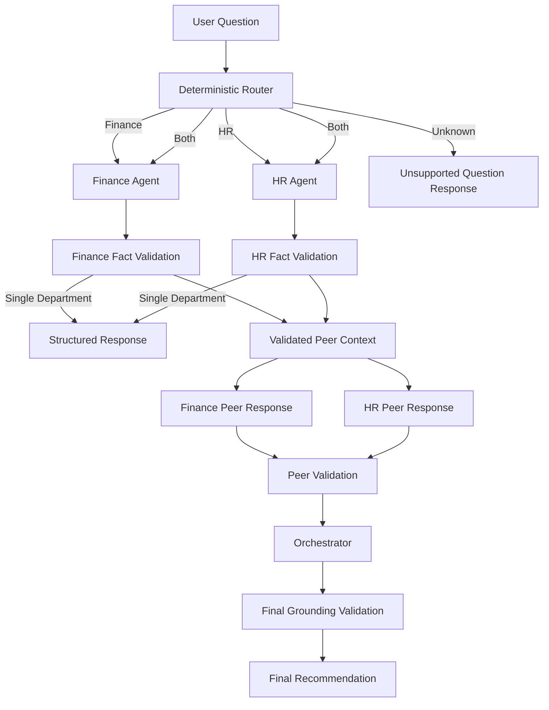

# Architecture

## 1. Overview

The Multi-Agent Department Assistant is a small TypeScript system that demonstrates structured coordination between isolated AI agents.

The application accepts a user question, routes it to the relevant department, grounds model outputs against trusted data, and produces either a single-department answer or a cross-department recommendation.

The architecture prioritizes:

* clear separation of responsibilities
* strict department data isolation
* grounded LLM outputs
* predictable orchestration
* graceful failure handling
* testability without real API calls

The current implementation contains two domain agents:

* Finance Agent
* HR Agent

## 2. System Architecture



## 3. Main Components

### CLI

The CLI is the application's entry point.

It:

* accepts the user's question
* initializes the application
* sends the question to the application service
* prints the final structured JSON response

The CLI contains no business or orchestration logic.

### Application Service

`app.ts` connects the main components of the system.

It:

1. validates the question
2. calls the router
3. dispatches the request to Finance, HR, both agents, or the unknown fallback
4. invokes the orchestrator when both departments are required

This keeps routing and orchestration separate from the user interface.

### Router

The router uses deterministic keyword rules to classify questions as:

```text
finance
hr
both
unknown
```

A deterministic router was chosen because the current domain contains only two departments.

This approach provides:

* predictable behavior
* no additional LLM call
* low latency
* transparent routing decisions
* straightforward unit testing

For a larger number of agents, this component could later be replaced by a semantic or LLM-based classifier.

## 4. Agent Design

Both agents implement a shared contract while keeping their domain data separate.

```text
Finance Agent ──► Finance data only
HR Agent      ──► HR data only
```

Each agent receives its dataset through constructor dependency injection.

```ts
new FinanceAgent(llmClient, financeData);
new HrAgent(llmClient, hrData);
```

An agent's normal `answer()` method accepts only the user question.

This prevents application code from accidentally passing arbitrary cross-department data into an agent.

### Agent Output

Agents return a structured response containing:

```json
{
  "answer": "...",
  "factKeys": ["approvedHiringBudget"],
  "assumptions": [],
  "confidence": "high"
}
```

The model does not control the authoritative values included in the final response.

Those values are resolved by application code.

## 5. Grounding Strategy

The grounding layer is designed to reduce unsupported LLM-generated facts.

Instead of asking the model to return trusted values directly, each department exposes an allow-list of valid fact keys.

For example:

```text
approvedHiringBudget
cashBalance
engineeringOpenRoles
capacityNotes
```

The flow is:

```text
Model response
      ↓
Returned fact keys
      ↓
Allow-list validation
      ↓
Trusted application data
      ↓
Resolved GroundedFact objects
```

If the model references an unsupported fact key, the output is rejected rather than silently accepted.

The application therefore remains responsible for authoritative factual values.

## 6. Data Isolation

Finance and HR data are stored in separate modules.

Each agent has access only to its own raw dataset.

During cross-department communication, agents do not receive the other department's raw data.

Instead, they receive a limited validated context containing fields such as:

* department
* answer
* grounded facts
* assumptions
* confidence

This allows agents to react to another department's position without breaking the data boundary.

```text
HR raw data
   │
   ▼
HR Agent
   │
   ▼
Validated HR response
   │
   ▼
Finance Agent

Finance Agent never receives HR raw data.
```

The same rule applies in the opposite direction.

## 7. Cross-Department Orchestration

Cross-department questions use a bounded discussion flow.

```text
User Question
     │
     ▼
Finance Initial Analysis ─────┐
                              │
HR Initial Analysis ──────────┤
                              ▼
                       Grounding Validation
                              │
                 ┌────────────┴────────────┐
                 ▼                         ▼
       Finance Peer Response      HR Peer Response
                 │                         │
                 └────────────┬────────────┘
                              ▼
                       Response Validation
                              │
                              ▼
                          Synthesis
                              │
                              ▼
                     Final Recommendation
```

### Flow

1. Finance and HR independently answer the original question.
2. Both responses are validated and grounded.
3. Finance receives the validated HR position.
4. HR receives the validated Finance position.
5. Each agent produces one refinement.
6. Peer responses are validated.
7. The orchestrator synthesizes a final recommendation.
8. Final fact references are checked before returning the response.

A complete cross-department flow uses up to five LLM operations:

```text
1. Finance initial analysis
2. HR initial analysis
3. Finance peer refinement
4. HR peer refinement
5. Final synthesis
```

## 8. Why the Discussion Is Bounded

The agents communicate for only one peer-response round.

This is intentional.

Open-ended autonomous loops can introduce:

* unpredictable latency
* increasing API cost
* repeated arguments
* difficult testing
* unclear termination conditions

One refinement round provides useful cross-agent interaction while keeping the workflow understandable and deterministic.

## 9. Final Synthesis Validation

The orchestrator does not blindly trust its own LLM synthesis.

Before returning a final recommendation, the system verifies that:

* the response contains valid fact references
* referenced facts came from grounded agent responses
* unsupported fact identifiers are not introduced
* both departments are represented when both provided grounded input

If these checks fail, the system returns a conservative low-confidence fallback.

## 10. Failure Handling

The system is designed to degrade safely instead of failing the entire request whenever possible.

### Invalid Agent Output

If an agent returns malformed or unsupported data:

```text
Agent output
    ↓
Validation fails
    ↓
Low-confidence fallback
```

### Missing Grounded Information

If one department cannot provide grounded facts, the system does not produce a normal cross-department recommendation.

Instead, it reports that there is insufficient information.

### Peer Response Failure

Finance and HR peer-response calls run independently.

The system uses `Promise.allSettled`, so failure of one peer response does not automatically discard the other valid response.

### Invalid Final Synthesis

If the final model response references unsupported facts or fails validation, the application returns a conservative fallback based on the grounded department responses.

## 11. LLM Abstraction

LLM access is isolated behind an `LlmClient` interface.

```text
Application
    │
    ▼
LlmClient
    │
    ▼
OpenAiLlmClient
    │
    ▼
OpenAI API
```

This prevents the rest of the application from depending directly on the OpenAI SDK.

It also allows tests to replace the real model with deterministic mock implementations.

## 12. Testing Strategy

Tests focus on the deterministic behavior surrounding the LLM rather than trying to unit-test model intelligence.

Mock LLM clients allow the system to test:

* routing
* dependency dispatch
* agent data isolation
* fact-key validation
* trusted value resolution
* invalid model outputs
* peer-response behavior
* failed peer calls
* synthesis validation
* conservative fallback behavior
* prevention of raw cross-department data sharing

This keeps tests fast, deterministic, and independent of API availability.

## 13. Project Structure

```text
src/
├── agents/
│   ├── Agent.ts
│   ├── FinanceAgent.ts
│   ├── HrAgent.ts
│   └── prompts.ts
│
├── data/
│   ├── financeData.ts
│   └── hrData.ts
│
├── llm/
│   ├── LlmClient.ts
│   └── OpenAiLlmClient.ts
│
├── orchestration/
│   ├── groundingValidation.ts
│   └── orchestrator.ts
│
├── routing/
│   └── router.ts
│
├── utils/
│   ├── errorMessage.ts
│   └── parseJsonResponse.ts
│
├── app.ts
├── cli.ts
└── domain.ts

tests/
├── agents.test.ts
├── app.test.ts
├── groundingValidation.test.ts
├── orchestrator.test.ts
└── router.test.ts
```

## 14. Key Design Decisions

### Direct orchestration instead of an agent framework

The workflow is small enough to implement directly.

Avoiding an agent framework keeps important behavior visible in the code:

* agent boundaries
* prompts
* validation
* routing
* data flow
* failure handling
* termination conditions

### Structured outputs instead of free-form responses

Structured JSON makes model responses easier to validate and integrate with application logic.

### Application-controlled facts

The LLM identifies relevant facts, while application code controls their authoritative values.

This creates a clearer trust boundary between generated reasoning and stored data.

### Dependency injection

Agents and the orchestrator receive their dependencies through constructors or application wiring.

This improves testability and avoids tightly coupling domain logic to external services.

### Parallel execution

Independent Finance and HR operations are executed concurrently where possible to reduce cross-department request latency.

## 15. Current Scope

The current implementation intentionally focuses on orchestration, grounding, and isolation.

It includes:

* two department agents
* mock business data
* deterministic routing
* OpenAI integration
* structured outputs
* one bounded peer discussion
* grounding validation
* CLI interaction
* automated tests

It does not currently include:

* database persistence
* user authentication
* REST API
* web interface
* vector database
* document RAG
* long-term memory
* real HR or Finance integrations
* autonomous agent loops

## 16. Future Extensions

The architecture can be extended without changing the core agent contracts.

Possible additions include:

* more department agents
* REST API
* PostgreSQL persistence
* tool calling
* role-based access control
* RAG over internal documents
* semantic routing
* persistent conversations
* evaluation datasets
* tracing and observability
* token and cost monitoring
* Docker deployment
* GitHub Actions CI/CD

The existing separation between routing, agents, orchestration, grounding, and LLM access provides a foundation for those additions.
