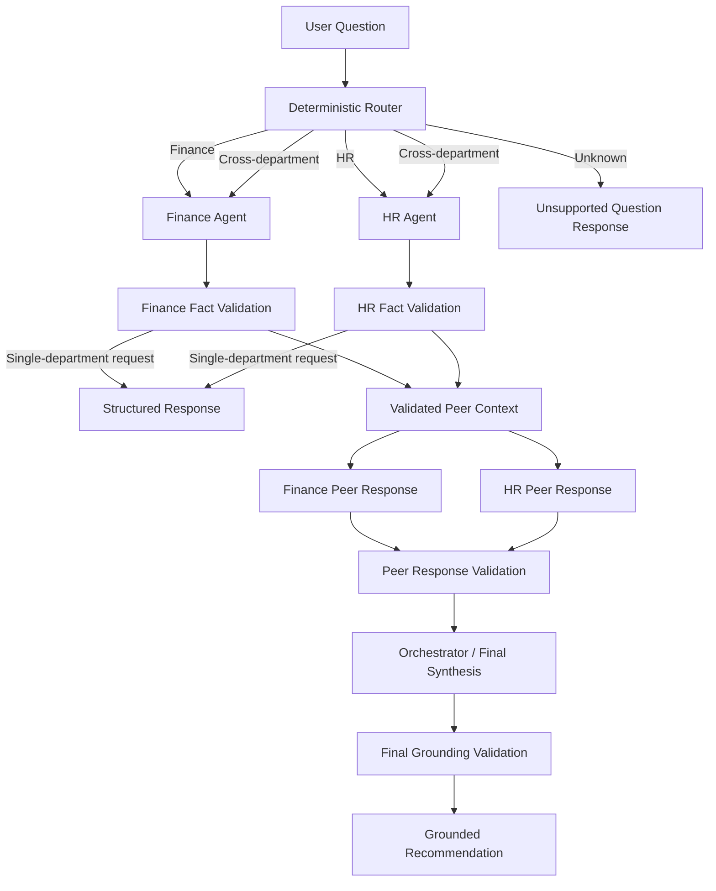

# Multi-Agent Department Assistant

A TypeScript multi-agent AI system that routes business questions to isolated department agents, validates their factual claims against trusted data, and coordinates cross-department reasoning through a bounded orchestration flow.

The project focuses on reliable LLM orchestration rather than autonomous agent loops: department data is isolated, model outputs are validated before use, and unsupported facts are rejected before reaching the final response.

## Key Features

* **Specialized AI agents** for Finance and HR
* **Deterministic routing** between Finance, HR, both departments, or an unsupported route
* **Strict department data isolation**
* **Bounded peer-to-peer agent discussion**
* **Fact-key grounding and validation**
* **Structured LLM responses**
* **Graceful fallback behavior**
* **Mockable LLM abstraction**
* **Unit-tested orchestration and failure scenarios**
* **Strict TypeScript configuration**

## Architecture



### Cross-Department Flow

```text
User question
     │
     ▼
Deterministic Router
     │
     ▼
 ┌─────────┐     ┌─────────┐
 │ Finance │     │   HR    │
 │  Agent  │     │  Agent  │
 └────┬────┘     └────┬────┘
      │               │
      ▼               ▼
 Fact validation   Fact validation
      │               │
      └───────┬───────┘
              ▼
      Validated peer context
              │
      ┌───────┴────────┐
      ▼                ▼
 Finance refinement   HR refinement
      │                │
      └───────┬────────┘
              ▼
      Validation & grounding
              │
              ▼
         Orchestrator
              │
              ▼
      Final recommendation
```

Cross-department discussions are deliberately limited to **one peer-response round**. This keeps cost, latency, behavior, and testing predictable while still allowing agents to refine their positions based on another department's validated perspective.

## How It Works

### 1. Routing

A deterministic router classifies each question as:

* `finance`
* `hr`
* `both`
* `unknown`

For this small domain, rule-based routing keeps behavior predictable, inexpensive, and easy to test.

### 2. Department Agents

Each agent receives only its own department data.

```ts
new FinanceAgent(llmClient, financeData);
new HrAgent(llmClient, hrData);
```

The model returns structured output with an answer, fact keys, assumptions, and confidence.

### 3. Grounding

Instead of trusting model-generated values, the application validates returned fact keys against an allow-list and resolves the actual values from trusted data.

Unsupported or invalid facts are rejected.

### 4. Cross-Department Orchestration

For questions requiring both departments:

1. Finance and HR analyze the question independently.
2. Their responses are validated.
3. Each agent receives the other's validated position.
4. Both produce one refinement.
5. The orchestrator generates a grounded final recommendation.

The discussion is limited to one round to keep cost, latency, and behavior predictable.

## Reliability and Failure Handling

The orchestration layer is designed to degrade safely.

Examples include:

* invalid model output → low-confidence fallback
* unsupported fact keys → response rejected
* missing grounded facts → synthesis skipped
* one failed peer response → synthesis continues with valid information
* unsupported final synthesis facts → conservative fallback
* cross-department synthesis using only one department → rejected

The system prioritizes grounded information over producing an answer at all costs.

## Project Structure

```text
src/
├── agents/
│   ├── Agent.ts
│   ├── FinanceAgent.ts
│   ├── HrAgent.ts
│   └── prompts.ts
│
├── data/
│   ├── financeData.ts
│   └── hrData.ts
│
├── llm/
│   ├── LlmClient.ts
│   └── OpenAiLlmClient.ts
│
├── orchestration/
│   ├── groundingValidation.ts
│   └── orchestrator.ts
│
├── routing/
│   └── router.ts
│
├── utils/
│   ├── errorMessage.ts
│   └── parseJsonResponse.ts
│
├── app.ts
├── cli.ts
└── domain.ts

tests/
├── agents.test.ts
├── app.test.ts
├── groundingValidation.test.ts
├── orchestrator.test.ts
└── router.test.ts
```

## Tech Stack

* **TypeScript**
* **Node.js**
* **OpenAI API**
* **Vitest**
* **tsx**
* **dotenv**

TypeScript runs with strict compiler settings including:

* `strict`
* `noUncheckedIndexedAccess`
* `exactOptionalPropertyTypes`

## Setup

Requires Node.js 20+.

```bash
git clone https://github.com/Daniellel1999/multi-agent-department-assistant.git
cd multi-agent-department-assistant

npm install
cp .env.example .env
```

Add your OpenAI API key:

```env
OPENAI_API_KEY=your_api_key_here
```

You can optionally configure the model:

```env
OPENAI_MODEL=your_model_name
```

## Usage

Ask a Finance question:

```bash
npm run dev -- "What is our monthly revenue?"
```

Ask an HR question:

```bash
npm run dev -- "How many open roles do we have?"
```

Ask a cross-department question:

```bash
npm run dev -- "Should we hire more people?"
```

Unsupported questions are rejected instead of being forwarded to an unrelated agent:

```bash
npm run dev -- "What is the weather tomorrow?"
```

## Response Format

Responses are returned as structured JSON:

```json
{
  "answer": "Yes, but selectively...",
  "factsUsed": [
    {
      "source": "finance",
      "label": "Approved hiring budget",
      "value": 240000,
      "path": "approvedHiringBudget"
    }
  ],
  "assumptions": [],
  "confidence": "medium",
  "department": "both"
}
```

## Testing

Run the test suite:

```bash
npm test
```

Run TypeScript validation:

```bash
npm run typecheck
```

Tests use mock LLM clients, so they do not require an OpenAI API key.

The suite covers:

* Finance, HR, cross-department, and unknown routing
* department data isolation
* fact-key validation
* trusted value resolution
* invalid fact rejection
* bounded peer discussion
* peer-response failures
* synthesis grounding
* conservative fallback behavior
* application dispatch
* prevention of raw cross-department data sharing

## Design Decisions

### Why deterministic routing?

The domain contains only two departments, so a rule-based router is easier to understand, cheaper to run, and more predictable than introducing an additional LLM classification step.

### Why not use an agent framework?

The orchestration requirements are small enough to implement directly.

Avoiding an additional framework keeps the agent lifecycle, data boundaries, prompts, validation logic, and failure behavior explicit in the codebase.

### Why one discussion round?

Open-ended agent conversations can introduce unpredictable cost, latency, and behavior.

A bounded interaction allows agents to respond to another department's perspective while keeping the workflow deterministic and testable.

### Why fact keys instead of trusting generated values?

Models can produce plausible but unsupported numbers.

Having the model reference known fact identifiers allows application code to validate the claim and resolve the authoritative value itself.

## Current Scope

This repository focuses specifically on multi-agent orchestration and grounding.

It intentionally uses:

* two departments
* hardcoded mock business data
* a CLI interface
* deterministic routing
* one bounded discussion round

It does not currently include:

* database persistence
* authentication
* REST API
* web UI
* vector search or RAG
* long-term agent memory
* external Finance or HR integrations
* autonomous agent loops

These are potential extensions rather than requirements for the core orchestration design.

## Possible Extensions

Future versions could include:

* REST API with Fastify or Express
* persistent conversations
* PostgreSQL-backed department data
* role-based access control
* additional department agents
* tool calling
* RAG over internal documents
* dynamic routing for larger agent sets
* observability and token/cost tracking
* evaluation datasets for agent quality
* Docker deployment
* CI/CD with GitHub Actions
